<div align="center">


<a href="https://git.io/typing-svg">
  
</a>

<br/>


<br/>

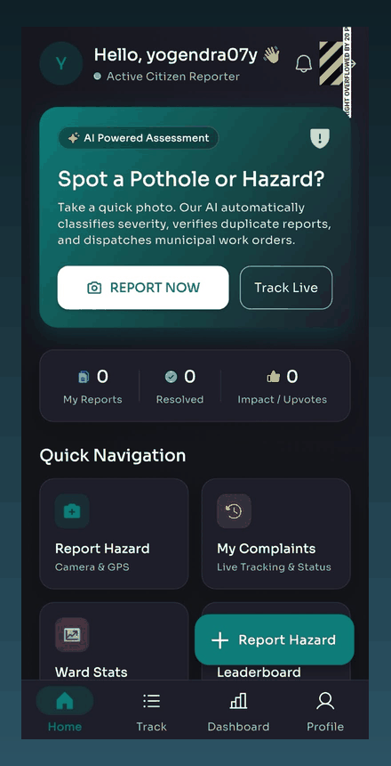

<sub><b>Live demo</b> — report → AI inspection → live tracking</sub>

</div>

---

## 📖 Table of Contents

[The Problem](#-the-problem) · [Our Solution](#-our-solution) · [How It Works](#-how-it-works) · [App Tour](#-app-tour) · [Features](#-features) · [Architecture](#-architecture) · [Results](#-results) · [Tech Stack](#-tech-stack) · [Getting Started](#-getting-started) · [Roadmap](#-roadmap) · [Limitations](#-honest-limitations) · [SDG Alignment](#-sdg-alignment)

---

## 🚧 The Problem

A pothole ignored today becomes a resurfacing project next year: rain widens the crack, vehicles chip the edges, and accidents and repair costs keep climbing.

Bengaluru's own civic app, **Raste Gundi Gamana (BBMP)**, shows why citizens give up on reporting:

| Pain point | What citizens experience |
|---|---|
| 📷 **Live-photo only** | You must stand at the pothole and capture on the spot — no gallery upload |
| 📍 **Fragile location** | GPS pin is error-prone and can't be corrected easily |
| 🕳️ **Black-box status** | No visibility into what happens after you submit |
| ⚖️ **No prioritization** | A dangerous crater and a hairline crack sit in the same queue |

> Result: slow repairs, duplicate complaints, and eroded public trust.

---

## 💡 Our Solution

**RoadSense AI** turns one citizen photo into a verified, prioritized, trackable maintenance request — with no manual re-entry.

Instead of training and hosting yet another detection model, it sends the image to **Google's Gemini Vision API**, which returns a structured result (defect type, severity, description). RoadSense wraps that in the parts a civic system actually needs: authenticity screening, duplicate merging, priority ranking, work orders, and public dashboards.

---

## ⚙️ How It Works

<div align="center">
  
</div>

<br/>

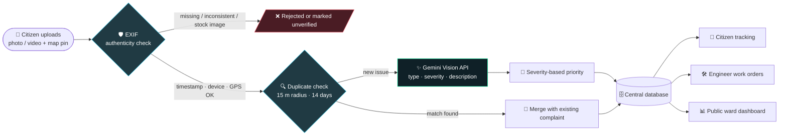

### The five steps, in plain words

1. **Capture** — snap a photo (or pick one from the gallery, or add a short video) and adjust the map pin if GPS is off.
2. **Authenticity screening** — EXIF metadata (timestamp, device, GPS) is examined. Downloaded / stock photos are flagged and the citizen is asked for a real on-site photo. *EXIF is an indicator, not proof — metadata can be stripped or edited.*
3. **Duplicate detection** — new coordinates are compared with recent reports (**15 m radius, 14-day window**). Matches are merged instead of logged twice.
4. **Gemini analysis** — the image goes to Gemini Vision with instructions about the damage types to identify. The response is parsed into structured fields: **damage type · severity · description**.
5. **Prioritize & track** — severity drives queue priority; the complaint appears in the citizen's tracker, the engineer's work-order inbox, and the ward dashboard.

<details>
<summary><b>🎬 See the request as a sequence diagram</b></summary>

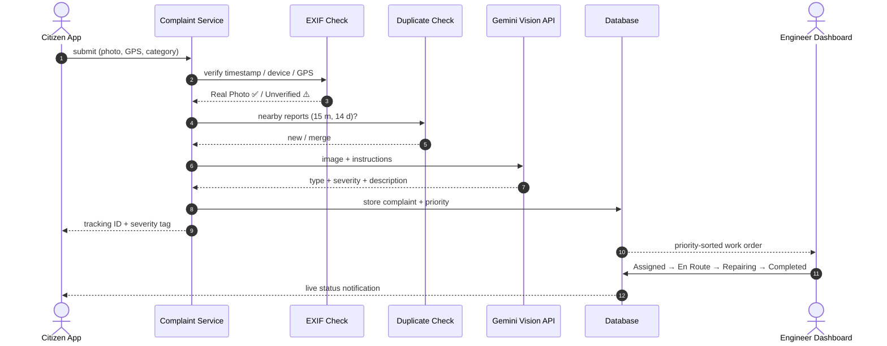

</details>

<details>
<summary><b>🔄 See the complaint lifecycle</b></summary>

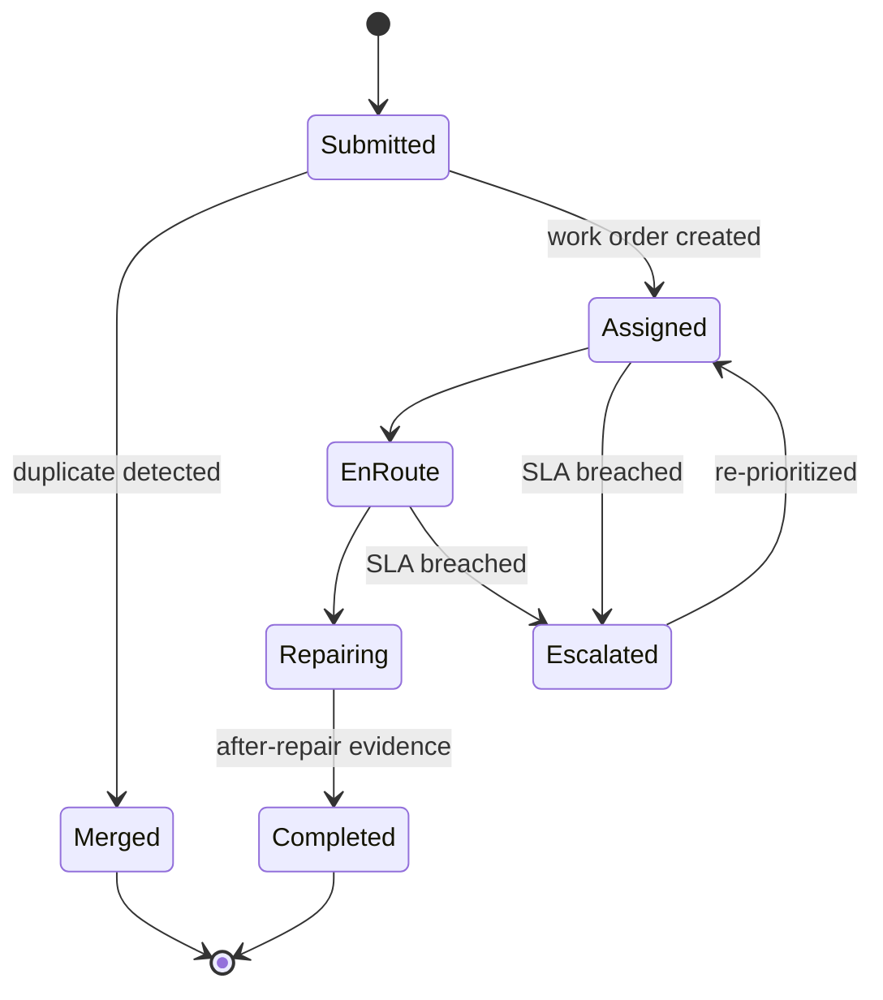

</details>

---

## 📱 App Tour

<div align="center">

| 🏠 Home | 📝 Report a Hazard | 🛡️ Authenticity Check |
|:---:|:---:|:---:|
| 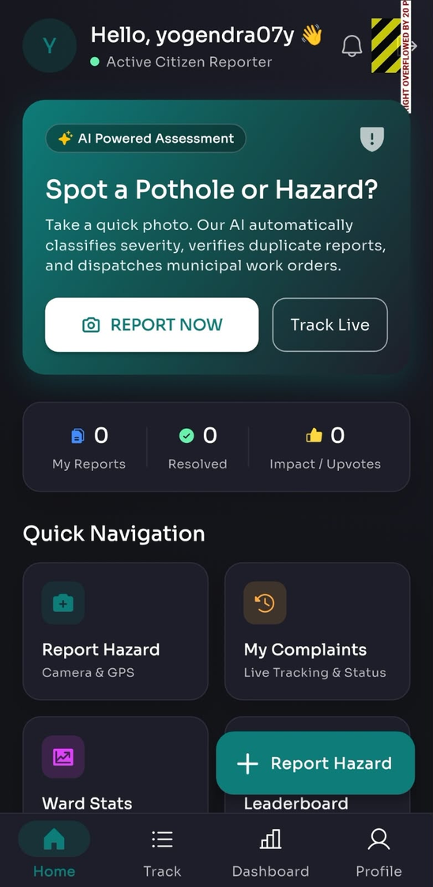 | 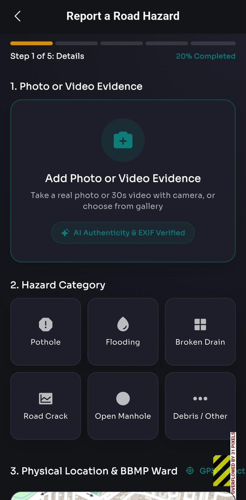 | 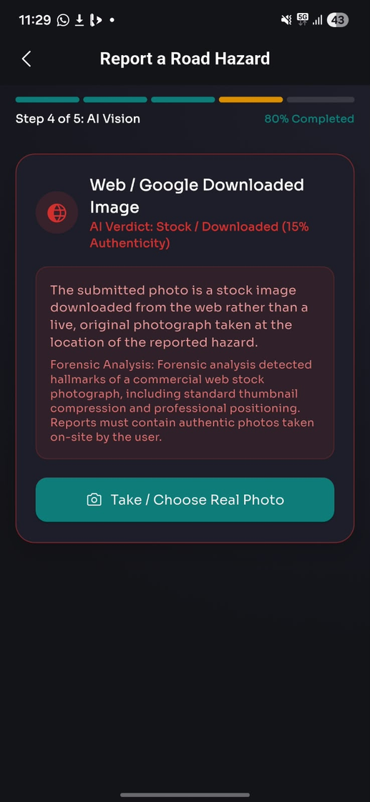 |
| Quick actions, personal impact stats and one-tap **Report Now** | 5-step guided flow: evidence → category → location & BBMP ward → AI vision → submit | Stock / web-downloaded images are rejected with a forensic explanation |

| 🤖 AI Inspection | 📊 Ward Dashboard |
|:---:|:---:|
| 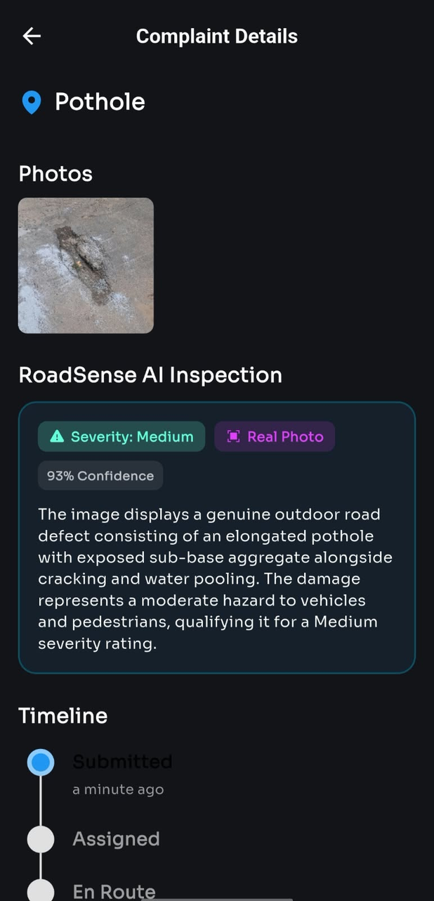 | 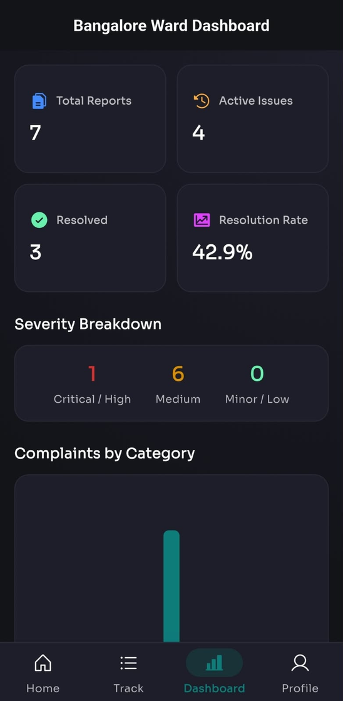 |
| Severity, **Real Photo** tag, confidence and a plain-language damage description, plus a live status timeline | Public transparency: total / active / resolved, resolution rate, severity breakdown, complaints by category |

</div>

---

## ✨ Features

| | Feature | Details |
|---|---|---|
| 📸 | **Flexible reporting** | Camera, gallery, multiple images or short (≈30 s) video |
| 📍 | **Map-pin correction** | Fix inaccurate GPS before submitting |
| 🛡️ | **EXIF authenticity screening** | Timestamp, device and GPS checks; flags stock / downloaded photos |
| 🔍 | **Duplicate merging** | Spatial + temporal matching (15 m / 14 days) |
| ✨ | **Gemini-powered inspection** | Defect type, severity and description — no custom model to train or host |
| 🚦 | **Severity-based priority** | Dangerous issues rise to the top of the queue instead of first-come-first-served |
| 🛠️ | **Role-based work orders** | Engineers assign and update status; admins manage users and wards |
| ⏱️ | **SLA tracking** | Deadlines and escalation when repairs run late |
| 📊 | **Public ward dashboard** | Ward-wise performance and complaint analytics |
| 🔔 | **Live status updates** | Assigned → En Route → Repairing → Completed |

---

## 🏗️ Architecture

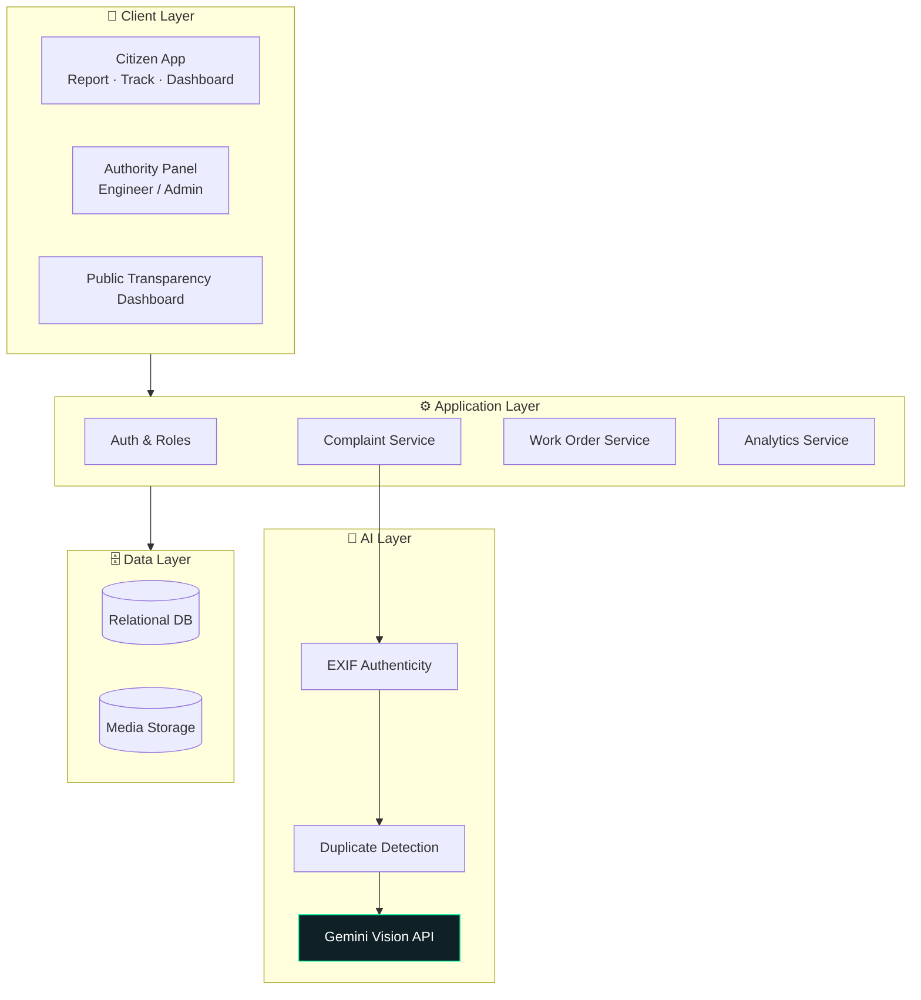

**Design principle:** Gemini only *interprets the image*. RoadSense AI owns everything else — storage, EXIF screening, location handling, duplicate detection, prioritization and dashboards — which keeps each stage simple to reason about and swap out.

---

## 📈 Results

Evaluated on a curated set of **1,200 road images** (potholes 40 %, transverse cracks 35 %, surface deterioration / ravelling 25 %) — 800 from public road-condition datasets and 400 captured on-site around Bengaluru.

| Split | Images | Purpose |
|---|---|---|
| Development | 960 (80 %) | Prompt wording & threshold tuning (Gemini was **not** fine-tuned) |
| Held-out test | 240 (20 %) | Final evaluation only |

<div align="center">

| 🎯 Defect-type accuracy | ⚡ Avg. response time | 🧠 Custom model to maintain |
|:---:|:---:|:---:|
| **93.3 %** (224 / 240) | **1.42 s** | **None** |

</div>

> 📝 The 93.3 % figure covers **defect-type classification only**. Severity has no independently verified ground truth, so it is reported as an application-level estimate, and the confidence score shown in the app is model-reported — not a calibrated statistical confidence.

---

## 🧰 Tech Stack

| Layer | Technology |
|---|---|
| App | Flutter / Dart (Android · iOS · Web · Windows · macOS · Linux targets) |
| Backend | Supabase (auth, database, storage) |
| Vision AI | Google Gemini Vision API |
| Authenticity | EXIF metadata analysis (timestamp, device, GPS) |
| Duplicates | Geo-distance + time-window matching |
| Maps | Google Maps Platform |

---

## 🚀 Getting Started

### Prerequisites
- [Flutter SDK](https://docs.flutter.dev/get-started/install) (stable channel)
- A [Supabase](https://supabase.com) project
- A [Gemini API key](https://ai.google.dev)

### Run locally

```bash
# 1. Clone
git clone https://github.com/yogendrag196-dev/roadsense_app.git
cd roadsense_app

# 2. Configure environment
cp .env.example .env
# open .env and fill in your Supabase URL / anon key and Gemini API key

# 3. Install dependencies
flutter pub get

# 4. Run
flutter run            # connected device or emulator
flutter run -d chrome  # web
```

> 🔐 Never commit real keys. `.env` is git-ignored; only `.env.example` belongs in the repo.

---

## 🗺️ Roadmap

- [x] Citizen reporting with gallery / video upload and map-pin correction
- [x] EXIF authenticity screening
- [x] Gemini-based damage classification and description
- [x] Duplicate detection and severity-based prioritization
- [x] Complaint tracking and public ward dashboard
- [ ] Benchmark against YOLOv8 / RT-DETR (precision, recall, F1, confusion matrix)
- [ ] Sensitivity analysis of the 15 m / 14-day duplicate thresholds
- [ ] Independent ground-truth validation of severity
- [ ] More defect types; dashcam and vehicle-sensor inputs
- [ ] Predictive maintenance using rainfall, traffic and pavement age
- [ ] Municipal work-order API integration and ward pilot

---

## ⚠️ Honest Limitations

- Depends on network connectivity and a third-party API.
- EXIF is a **screening signal**, not proof of authenticity.
- Duplicate thresholds are application-level choices, not yet validated.
- No direct comparison with dedicated detectors (YOLOv8, RT-DETR) has been carried out; we do not claim Gemini outperforms them.

---

## 🌍 SDG Alignment

| SDG | How RoadSense AI contributes |
|---|---|
| **9** — Industry, Innovation & Infrastructure | AI-assisted infrastructure monitoring |
| **11** — Sustainable Cities & Communities | Faster, data-driven road maintenance |
| **16** — Peace, Justice & Strong Institutions | Transparency through public dashboards and audit trails |

---

<div align="center">

**If RoadSense AI made you think about the potholes on your street, consider giving it a ⭐**


</div>
